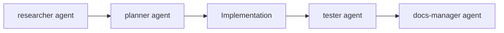

# Agent Orchestration Guide

**Last Updated**: 2025-11-07
**Framework**: ClaudeKit
**Primary Agents**: mesh-validator, neuro-reviewer

## Overview

Agent orchestration is the coordination of multiple AI agents to accomplish complex tasks efficiently. For NeuroDB-2, the primary orchestration pattern is **parallel dual validation**, where two specialized agents validate different aspects of neuroscience terminology data simultaneously.

## Core Orchestration Principles

### 1. Parallel Execution for Independent Tasks
**When to use**: Tasks that don't depend on each other's results

**Benefits**:
- Faster completion (concurrent execution)
- Reduced total wait time
- Better resource utilization
- Simplified coordination

**NeuroDB-2 Application**:
- mesh-validator validates MeSH terms
- neuro-reviewer validates all other fields
- Both can run simultaneously (no dependencies)

### 2. Sequential Execution for Dependent Tasks
**When to use**: Tasks where later steps need earlier results

**Benefits**:
- Clear dependencies
- Guaranteed order of operations
- Easier error handling

**NeuroDB-2 Application**:
- Apply corrections (must complete first)
- Re-validate corrections (depends on corrections being applied)
- Human review (depends on validation passing)

### 3. Minimize Agent Invocations
**Strategy**: Avoid unnecessary agent calls to save tokens and time

**Tactics**:
- Full validation only once per letter
- Targeted re-validation (only corrected items, not full dataset)
- Batch corrections before re-validating
- Use local validation where possible (e.g., CSV structure checks)

## Dual Validation Architecture

### Agent Responsibilities

**mesh-validator** (Domain-Specific)
- **Scope**: ONLY "Closest MeSH term" field
- **Method**: NIH MeSH API validation
- **Authority**: Final authority on MeSH terms
- **Speed**: Fast (API millisecond responses)
- **Output**: PASS/FAIL report with suggested corrections

**neuro-reviewer** (Domain-Specific)
- **Scope**: ALL fields EXCEPT "Closest MeSH term"
- **Method**: Gemini CLI cross-validation
- **Authority**: Neuroscience domain knowledge
- **Speed**: Moderate (LLM inference)
- **Output**: PASS/FAIL report with error details and recommendations

### Non-Overlapping Validation

**Key Principle**: No field is validated by both agents

```
mesh-validator validates:
├── Closest MeSH term ✓

neuro-reviewer validates:
├── Term ✓
├── Term Two ✓
├── Definition ✓
├── Synonym 1, 2, 3 ✓
├── Abbreviation ✓
├── UK Spelling, US Spelling ✓
├── Noun/Verb/Adjective/Adverb Forms ✓
└── Commonly Associated Terms 1-8 ✓
```

## Parallel Execution Pattern

### Implementation

**CRITICAL**: Use single message with multiple Task tool calls

```markdown
I'll launch both validators in parallel to validate the letter G data.

<Task tool call: mesh-validator>
  Validate MeSH terms for letter G
</Task>

<Task tool call: neuro-reviewer>
  Validate all non-MeSH fields for letter G
</Task>
```

### Results Handling

**Both agents return reports independently**

**Scenario 1: Both PASS**
```
mesh-validator: PASS (all MeSH terms valid)
neuro-reviewer: PASS (all other fields valid)
→ Proceed to human review
```

**Scenario 2: One FAIL**
```
mesh-validator: FAIL (3 MeSH corrections needed)
neuro-reviewer: PASS (all other fields valid)
→ Apply MeSH corrections only
→ Re-run mesh-validator on corrected items (targeted)
→ Proceed to human review after pass
```

**Scenario 3: Both FAIL**
```
mesh-validator: FAIL (3 MeSH corrections needed)
neuro-reviewer: FAIL (5 definition/synonym issues)
→ Apply ALL corrections in single batch
→ Re-run BOTH agents on corrected items (targeted)
→ Proceed to human review after both pass
```

## Correction & Re-validation Workflow

### Step 1: Collect All Corrections

**From mesh-validator report**:
```markdown
- Term: "Babinski sign" → MeSH: "Reflex, Babinski" (was "Reflex Babinski")
- Term: "Blood-brain barrier" → MeSH: "Blood-Brain Barrier" (was "Blood Brain Barrier")
```

**From neuro-reviewer report**:
```markdown
- Term: "Bipolar cell" → Definition error: Remove "amacrine cell" (incorrect classification)
- Term: "Brain-derived neurotrophic factor" → Synonym issue: Move "BDNF" to Abbreviation field
```

### Step 2: Apply Corrections in Batch

**Single update operation** applying all corrections:
```python
# Pseudo-code
for correction in all_corrections:
    apply_correction(csv_data, correction)
write_csv(csv_data)  # Single write operation
```

**Benefits**:
- Atomic operation (all or nothing)
- Easier to track what was changed
- Single CSV write (avoids partial states)
- Clear audit trail

### Step 3: Update MeSH Tracking (If Applicable)

**Only when MeSH corrections applied**:

Update all 3 files:
1. `MeshValidation/mesh_corrections_log.json`
2. `MeshValidation/mesh_corrections_log.csv`
3. `MeshValidation/mesh_corrections_summary.md`

**Skip if**: Only neuro-reviewer corrections (no MeSH changes)

### Step 4: Targeted Re-validation

**CRITICAL**: Re-validate ONLY corrected items, not full dataset

**mesh-validator re-run** (if MeSH corrections applied):
```markdown
Re-validate these 2 MeSH terms:
- Babinski sign
- Blood-brain barrier

(Do NOT re-validate all 24 terms in letter)
```

**neuro-reviewer re-run** (if other corrections applied):
```markdown
Re-validate these fields:
- Bipolar cell: Definition
- Brain-derived neurotrophic factor: Synonym 3, Abbreviation

(Do NOT re-validate all terms/fields in letter)
```

## Orchestration Anti-Patterns

### ❌ Sequential When Should Be Parallel

**Wrong**:
```markdown
Run mesh-validator on letter G
[wait for result]
Run neuro-reviewer on letter G
[wait for result]
```

**Problem**: Double the wait time (no dependencies between validations)

**Right**:
```markdown
Run mesh-validator AND neuro-reviewer in parallel on letter G
[wait for both results simultaneously]
```

### ❌ Full Re-validation After Corrections

**Wrong**:
```markdown
Apply 2 MeSH corrections
Re-run mesh-validator on all 24 terms
```

**Problem**: Wastes tokens validating 22 unchanged terms

**Right**:
```markdown
Apply 2 MeSH corrections
Re-run mesh-validator ONLY on 2 corrected terms
```

### ❌ Incremental Corrections

**Wrong**:
```markdown
Apply correction 1
Re-validate
Apply correction 2
Re-validate
Apply correction 3
Re-validate
```

**Problem**: Multiple agent invocations, inefficient

**Right**:
```markdown
Apply corrections 1, 2, 3 in single batch
Re-validate corrected items once
```

### ❌ Overlapping Validation Scope

**Wrong**:
```markdown
mesh-validator validates: MeSH terms, synonyms
neuro-reviewer validates: synonyms, definitions
```

**Problem**: Duplicate work, potential conflicting corrections

**Right**:
```markdown
mesh-validator validates: ONLY MeSH terms
neuro-reviewer validates: Everything EXCEPT MeSH terms
```

## Agent Communication Patterns

### Report-Based Communication

**Agents output markdown reports** to communicate findings

**Advantages**:
- Human-readable
- Version-controllable (can save to `plans/reports/`)
- Easy to parse programmatically
- Clear audit trail

**Report Storage** (optional):
```
plans/reports/
├── letter_G_mesh_validation_2025-11-07.md
├── letter_G_neuro_review_2025-11-07.md
└── letter_H_mesh_validation_2025-11-08.md
```

### Coordinator Responsibilities

**Coordinator** (Claude Code main agent):
1. Launch agents in parallel
2. Collect both reports
3. Identify failures from either agent
4. Combine corrections from both sources
5. Apply corrections in single batch
6. Update tracking files (MeSH corrections)
7. Re-launch failed agent(s) with targeted re-validation
8. Present final data to human for review

## Advanced Orchestration Patterns

### Agent Chaining for Complex Tasks

**Example**: Research → Plan → Implement → Test → Document



**Not used in NeuroDB-2** (validation is independent, not chained)

### Parallel Research

**Example**: Investigating multiple documentation sources

```markdown
Launch 3 researcher agents in parallel:
- Agent 1: Research MeSH Browser documentation
- Agent 2: Research neuroscience textbook standards
- Agent 3: Research PubMed term usage patterns
```

**Potential NeuroDB-2 Application**:
- Researching rare terms not in Wikipedia Glossary
- Investigating conflicting MeSH mappings
- Finding authoritative sources for synonyms

## Token Optimization

### Minimize Agent Context

**Strategy**: Only provide data agents need

**mesh-validator**:
- ✅ Provide: Term, Closest MeSH term
- ❌ Don't provide: Definition, synonyms, word forms (not validated)

**neuro-reviewer**:
- ✅ Provide: All fields EXCEPT Closest MeSH term
- ❌ Don't provide: Closest MeSH term (not validated)

### Avoid Redundant Validation

**One-time full validation**:
```
Letter G (24 terms) → mesh-validator + neuro-reviewer
↓
Corrections identified (4 total)
↓
Apply all 4 corrections
↓
Re-validate ONLY 4 corrected items (targeted)
↓
Human review
```

**Inefficient alternative** (don't do):
```
Letter G (24 terms) → mesh-validator + neuro-reviewer
↓
Correction 1 applied → Full re-validation (24 terms)
↓
Correction 2 applied → Full re-validation (24 terms)
↓
Correction 3 applied → Full re-validation (24 terms)
↓
Correction 4 applied → Full re-validation (24 terms)
```

## Error Handling

### Agent Failure Scenarios

**Network Issues**:
- Retry agent invocation (transient failure)
- Check API availability (MeSH API down?)
- Verify internet connectivity

**Agent Returns Unexpected Format**:
- Review agent prompt for clarity
- Check agent definition file (`.claude/agents/`)
- Verify input data format matches expectations

**Validation Never Passes**:
- Review correction suggestions (are they correct?)
- Manually verify via external sources (MeSH Browser, literature)
- Consider if term genuinely has no valid MeSH mapping

### Fallback Strategies

**If mesh-validator consistently fails**:
1. Manually validate MeSH term via MeSH Browser
2. Document rationale for manual override
3. Proceed with human review (agent validation bypassed)

**If neuro-reviewer consistently fails**:
1. Break down validation into smaller chunks
2. Validate term-by-term instead of batch
3. Review agent prompt for issues

## Monitoring & Metrics

### Per-Letter Metrics
- Agent invocations: Target ≤ 3 total (1 initial + 1-2 re-validations)
- Corrections per agent: Track mesh vs neuro-reviewer correction rates
- Re-validation cycles: Target ≤ 2 (initial validation + 1 re-validation)
- Time to completion: Parallel should be ~50% faster than sequential

### Database-Wide Metrics
- Total agent invocations across all letters
- Average corrections per letter
- Most common error types (inform future prevention)
- Agent reliability (pass rate after corrections)

## Best Practices Summary

### DO
✅ Run mesh-validator + neuro-reviewer in parallel (single message, 2 Task calls)
✅ Apply all corrections in single batch before re-validating
✅ Use targeted re-validation (only corrected items)
✅ Update MeSH tracking files when MeSH corrections applied
✅ Minimize agent invocations (1 full validation per letter)
✅ Save validation reports for audit trail

### DON'T
❌ Run agents sequentially when they're independent
❌ Re-validate entire dataset after small corrections
❌ Apply corrections incrementally (one at a time)
❌ Overlap validation scope between agents
❌ Skip MeSH tracking file updates
❌ Invoke agents multiple times for same data

## Future Enhancements

### Potential Improvements
- Automated correction application (reduce manual steps)
- Validation report parsing (structured JSON output)
- Agent performance dashboards (track metrics over time)
- Self-healing validation (auto-retry on transient failures)
- Parallel letter processing (validate multiple letters simultaneously)

### Scalability Considerations
- Batch processing for large datasets
- Rate limiting for API calls (MeSH API)
- Distributed validation across multiple agents
- Incremental validation (validate new/changed terms only)

---

For implementation details, see CLAUDE.md Workflow 1 (Step 3: Automated Data Quality Review) and agent definitions at `.claude/agents/mesh-validator.md` and `.claude/agents/neuro-reviewer.md`.
