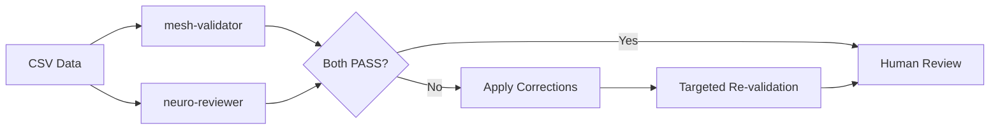

# MeSH Validation Guide

**Last Updated**: 2025-11-07
**Agent**: mesh-validator
**Validation Authority**: NIH National Library of Medicine MeSH API

## Overview

MeSH (Medical Subject Headings) is the National Library of Medicine's controlled vocabulary thesaurus used for indexing biomedical and health-related information. For NeuroDB-2, MeSH validation ensures that every neuroscience term maps to an authoritative, standardized medical classification.

## Why MeSH Validation Matters

### Research Applications
- Links terms to PubMed-indexed literature
- Enables cross-referencing with medical databases
- Provides standardized vocabulary for research papers
- Facilitates systematic literature reviews

### Data Quality
- Prevents typos and inconsistencies in term classifications
- Ensures terms map to official medical ontology
- Enables interoperability with other medical databases
- Maintains long-term data validity as MeSH evolves

### Clinical Relevance
- Medical coding and billing accuracy
- EHR (Electronic Health Record) integration
- Clinical decision support systems
- ICD-10/ICD-11 mapping capabilities

## MeSH Validation Agent

### Agent Specifications

**File**: `.claude/agents/mesh-validator.md`

**Capabilities**:
- Validates ONLY the "Closest MeSH term" column
- Uses official NIH MeSH API (https://id.nlm.nih.gov/mesh/)
- Returns exact match confirmations or suggested corrections
- Fast execution (API responses in milliseconds)
- Final authority on MeSH term accuracy

**Validation Scope**:
- ✅ Validates: "Closest MeSH term" field
- ❌ Does NOT validate: Definitions, synonyms, abbreviations, word forms, associated terms
- Partner agent (neuro-reviewer) handles all other fields

## Validation Process

### Step 1: Input Preparation

Agent receives CSV data with these columns:
```
Term, Term Two, Definition, Closest MeSH term, Synonym 1, Synonym 2, ...
```

Agent focuses exclusively on:
- `Term` (for context)
- `Closest MeSH term` (validation target)

### Step 2: API Validation

For each term, agent:
1. Queries NIH MeSH API: `https://id.nlm.nih.gov/mesh/[TERM].json`
2. Checks for exact match
3. Evaluates response:
   - **200 OK** → MeSH term is valid
   - **404 Not Found** → MeSH term is invalid
   - **Redirect** → MeSH term may be deprecated (check redirect target)

### Step 3: Error Detection

Agent identifies:
- **Exact matches** → PASS
- **Typos** → Suggests correction (e.g., "Reflex Babinski" → "Reflex, Babinski")
- **Wrong terms** → Suggests correct MeSH term
- **Missing commas** → MeSH terms often use comma format (e.g., "Blood-Brain Barrier" not "Blood Brain Barrier")
- **Deprecated terms** → Suggests updated MeSH term

### Step 4: Report Generation

Agent returns structured report:

```markdown
## MeSH Validation Report

### Summary
- Total terms validated: 24
- PASS: 22
- FAIL: 2

### Failed Validations

**Term**: Babinski sign
**Current MeSH**: "Reflex Babinski"
**Status**: FAIL
**Reason**: Missing comma in MeSH format
**Suggested Correction**: "Reflex, Babinski"
**API Response**: 404 Not Found

**Term**: Blood-brain barrier
**Current MeSH**: "Blood Brain Barrier"
**Status**: FAIL
**Reason**: Incorrect term format
**Suggested Correction**: "Blood-Brain Barrier"
**API Response**: 404 Not Found

### Recommendations
1. Apply all suggested corrections
2. Re-run validation on corrected terms only
```

## MeSH Term Format Rules

### Official Format Guidelines

**Comma Usage**:
- Inversions use commas: `"Reflex, Babinski"` not `"Reflex Babinski"`
- Main heading first: `"Neurons, Afferent"` not `"Afferent Neurons"`

**Hyphenation**:
- Compound terms often hyphenated: `"Blood-Brain Barrier"` not `"Blood Brain Barrier"`
- Check API for exact format

**Capitalization**:
- Title case for most terms: `"Basal Ganglia"`
- Check API for exceptions

**Singular vs Plural**:
- MeSH uses specific forms: `"Neuron"` vs `"Neurons"`
- Verify exact form via API

### Common Errors

**1. Missing Commas**
- ❌ `"Reflex Babinski"`
- ✅ `"Reflex, Babinski"`

**2. Incorrect Hyphenation**
- ❌ `"Blood Brain Barrier"`
- ✅ `"Blood-Brain Barrier"`

**3. Word Order**
- ❌ `"Afferent Neurons"`
- ✅ `"Neurons, Afferent"` (if MeSH uses inversion)

**4. Typos**
- ❌ `"Pressoreceptor"`
- ✅ `"Pressoreceptors"`

## Correction Workflow

### Applying Corrections

**Step 1: Review Report**
- Identify all FAIL entries
- Review suggested corrections
- Verify corrections are logical

**Step 2: Batch Update**
- Apply ALL corrections at once (not one-by-one)
- Update CSV data with corrected MeSH terms
- Document changes

**Step 3: Update Tracking Files**

When MeSH corrections are applied, update THREE files:

**A. mesh_corrections_log.json**
```json
{
  "B": [
    {
      "term": "Babinski sign",
      "original_mesh": "Reflex Babinski",
      "corrected_mesh": "Reflex, Babinski",
      "reason": "Missing comma in MeSH format"
    }
  ]
}
```

**B. mesh_corrections_log.csv**
```csv
Letter,Term,Original MeSH,Corrected MeSH,Reason
B,Babinski sign,Reflex Babinski,"Reflex, Babinski",Missing comma in MeSH format
```

**C. mesh_corrections_summary.md**
```markdown
## Letter B
- **Babinski sign**: "Reflex Babinski" → "Reflex, Babinski"
  - Reason: Missing comma in MeSH format
```

**Step 4: Targeted Re-validation**
- Re-run mesh-validator ONLY on corrected terms (not full dataset)
- Verify all corrections now PASS
- Proceed to human review

## MeSH API Reference

### Base URL
```
https://id.nlm.nih.gov/mesh/
```

### Query Format
```
https://id.nlm.nih.gov/mesh/[MESH_TERM].json
```

### Example Queries

**Valid Term**:
```bash
curl https://id.nlm.nih.gov/mesh/D001921.json
# Returns: Blood-Brain Barrier entry with full metadata
```

**Invalid Term**:
```bash
curl https://id.nlm.nih.gov/mesh/BloodBrainBarrier.json
# Returns: 404 Not Found
```

### Response Fields

When term is valid, API returns:
- `@id` - MeSH unique identifier (e.g., "http://id.nlm.nih.gov/mesh/D001921")
- `label` - Official MeSH term label
- `prefLabel` - Preferred label format
- `scopeNote` - Definition/scope of term
- `treeNumber` - MeSH hierarchy classification

## Common MeSH Terms in Neuroscience

### Frequently Used
- `"Neurons"` - Nerve cells
- `"Brain"` - Organ
- `"Neurotransmitters"` - Chemical messengers
- `"Synapses"` - Neural connections
- `"Action Potentials"` - Neural signaling
- `"Neuroglia"` - Support cells
- `"Central Nervous System"` - Brain and spinal cord
- `"Basal Ganglia"` - Subcortical structures

### Anatomy Terms
- `"Cerebral Cortex"` - Cortex
- `"Hippocampus"` - Memory structure
- `"Amygdala"` - Emotion center
- `"Cerebellum"` - Motor control
- `"Thalamus"` - Relay station
- `"Hypothalamus"` - Homeostasis center

### Physiology Terms
- `"Neurotransmission"` - Signal transmission
- `"Synaptic Plasticity"` - Learning mechanism
- `"Long-Term Potentiation"` - Memory formation
- `"Neurogenesis"` - Neuron generation

### Pathology Terms
- `"Neurodegeneration"` - Cell death
- `"Alzheimer Disease"` - Dementia
- `"Parkinson Disease"` - Movement disorder
- `"Epilepsy"` - Seizure disorder

## Troubleshooting

### Agent Returns All FAIL

**Problem**: Every term validation fails
**Causes**:
- Network connectivity issues with NIH API
- API rate limiting
- Malformed CSV input (wrong column headers)

**Solutions**:
- Check internet connection
- Verify NIH MeSH API is accessible (https://id.nlm.nih.gov/mesh/)
- Validate CSV has "Closest MeSH term" column header
- Check CSV encoding (UTF-8)

### Agent Suggests No Corrections

**Problem**: Agent identifies FAIL but provides no corrections
**Causes**:
- Term genuinely has no MeSH equivalent
- Term too specific (not in MeSH vocabulary)
- Requires manual MeSH database search

**Solutions**:
- Search MeSH Browser manually: https://meshb.nlm.nih.gov/
- Find closest parent term in MeSH hierarchy
- Document rationale if leaving field empty

### Corrections Still Fail Re-validation

**Problem**: Applied corrections but still get FAIL
**Causes**:
- Correction not applied correctly (typo)
- Wrong correction suggested by agent
- API response changed between validations

**Solutions**:
- Verify exact correction was applied (character-by-character)
- Manually test API: `curl https://id.nlm.nih.gov/mesh/[TERM].json`
- Check MeSH Browser for official format

## Best Practices

### Before Validation
1. Ensure CSV has proper column headers (exact match: "Closest MeSH term")
2. Remove any trailing spaces in MeSH term values
3. Verify CSV is UTF-8 encoded
4. Back up original CSV before applying corrections

### During Validation
1. Run mesh-validator in parallel with neuro-reviewer (independent validations)
2. Wait for complete report before making any changes
3. Review all FAIL entries for consistency
4. Question suggestions that seem incorrect

### After Validation
1. Apply ALL corrections in single batch (avoid partial updates)
2. Update all 3 MeSH tracking files (JSON, CSV, Markdown)
3. Run targeted re-validation on corrected terms only
4. Archive validation reports with date stamps

### Documentation
1. Keep audit trail of all MeSH corrections
2. Document rationale for any non-standard choices
3. Note any MeSH terms left empty (with reason)
4. Maintain version history of validation reports

## Integration with Workflow

### Dual Validation Pattern



**Key Points**:
- Run both agents in parallel (use single message with 2 Task tool calls)
- mesh-validator validates ONLY MeSH terms
- neuro-reviewer validates EVERYTHING ELSE
- Both must pass before human review
- Minimize agent invocations (full validation only once per letter)

## Resources

### Official MeSH Resources
- **MeSH Browser**: https://meshb.nlm.nih.gov/
- **MeSH API**: https://id.nlm.nih.gov/mesh/
- **MeSH Documentation**: https://www.nlm.nih.gov/mesh/
- **MeSH RDF Downloads**: https://hhs.github.io/meshrdf/

### NLM Tools
- **PubMed**: https://pubmed.ncbi.nlm.nih.gov/ (MeSH-indexed literature)
- **MeSH on Demand**: https://meshb.nlm.nih.gov/MeSHonDemand (auto-tagging)

---

For implementation details, see mesh-validator agent definition at `.claude/agents/mesh-validator.md` and CLAUDE.md workflow instructions.
